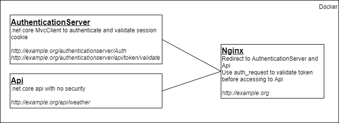

# demo-nginx-auth-request
## description
Simple app using nginx auth_request to secure Api

Use in memory user and Ldap to authenticate 
### structure

## Run
### prerequisite
Add following line on your hosts (on windows : C:\Windows\System32\Drivers\etc\hosts): 
>127.0.0.1 example.org

### Run the application
You simply need to run the docker-compose.yml 
> docker-compose up

then you can connect with Ldap or in memory user: 

Login : `bob`

Password : `bob`
### Configuration
You can change Ldap url with Environment variable `AppSettings__LdapUrl`

## Issues
### Ldap

For Ldap, i used [System.DirectoryServices](https://www.nuget.org/packages/System.DirectoryServices/) and on linux container, i got following error : 

`System.PlatformNotSupportedException: "System.DirectoryServices is not supported on this platform."`

More detail on https://github.com/dotnet/runtime/issues/23944

So i change to use [LdapForNet](https://www.nuget.org/packages/LdapForNet/) but got following error :
 
`LdapException : Unknown authentication method. SASL(-4): no mechanism available: No worthy mechs found. Result: -6. Method: BindSasl`

Investigation stop at this point but seem to be a missing package on linux container.